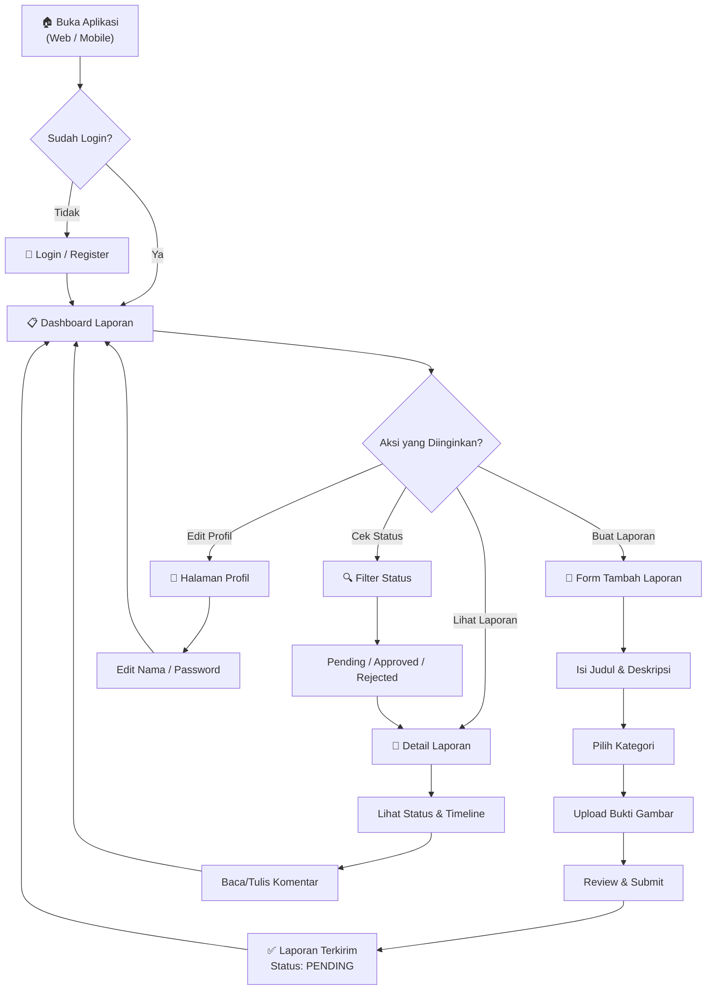
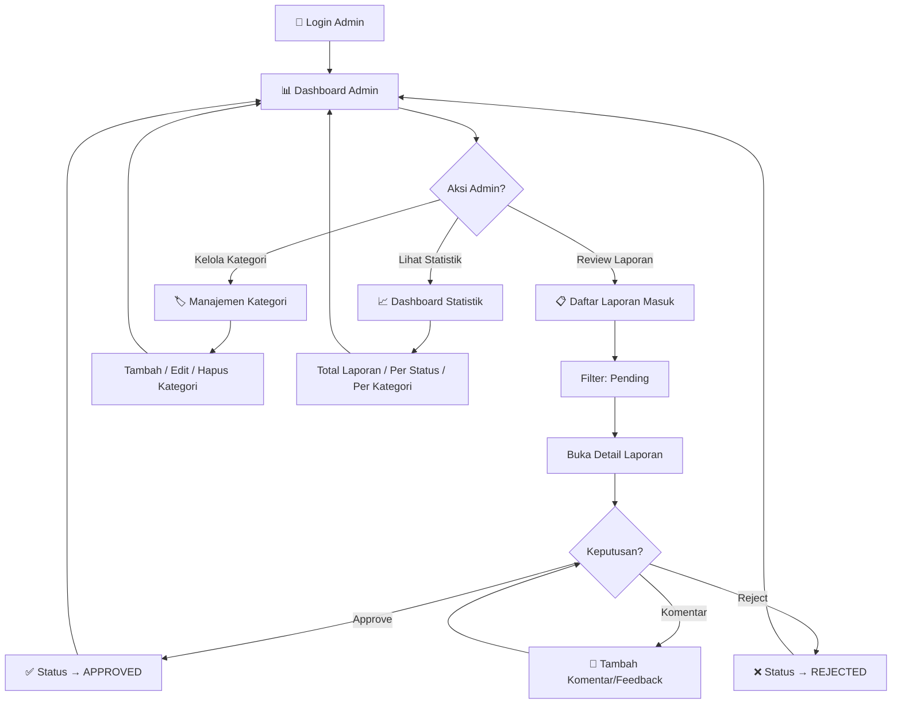
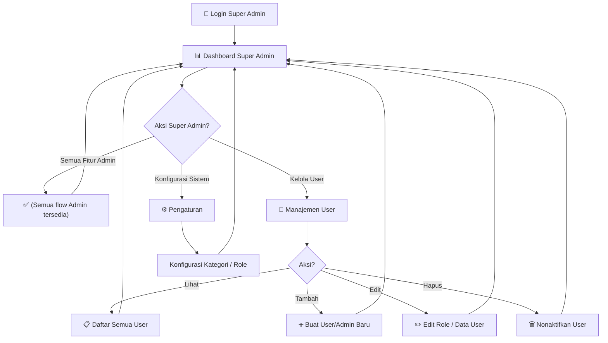
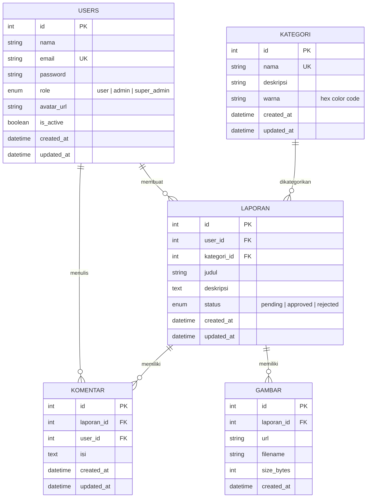
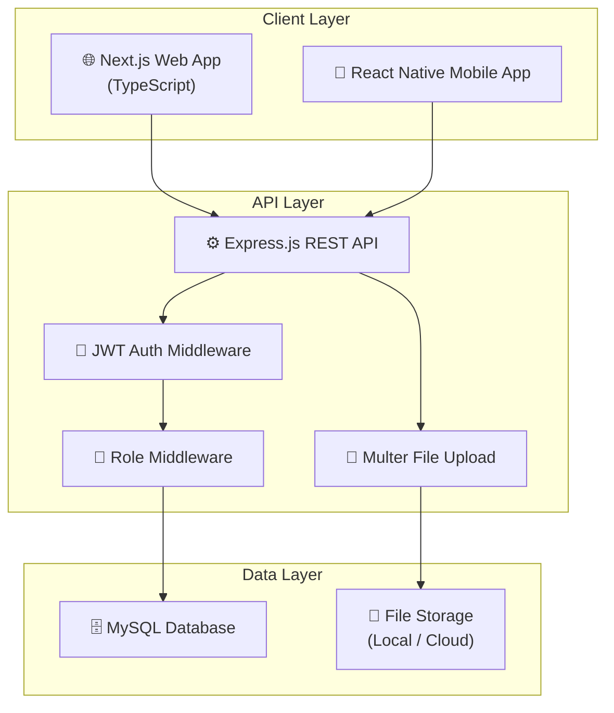
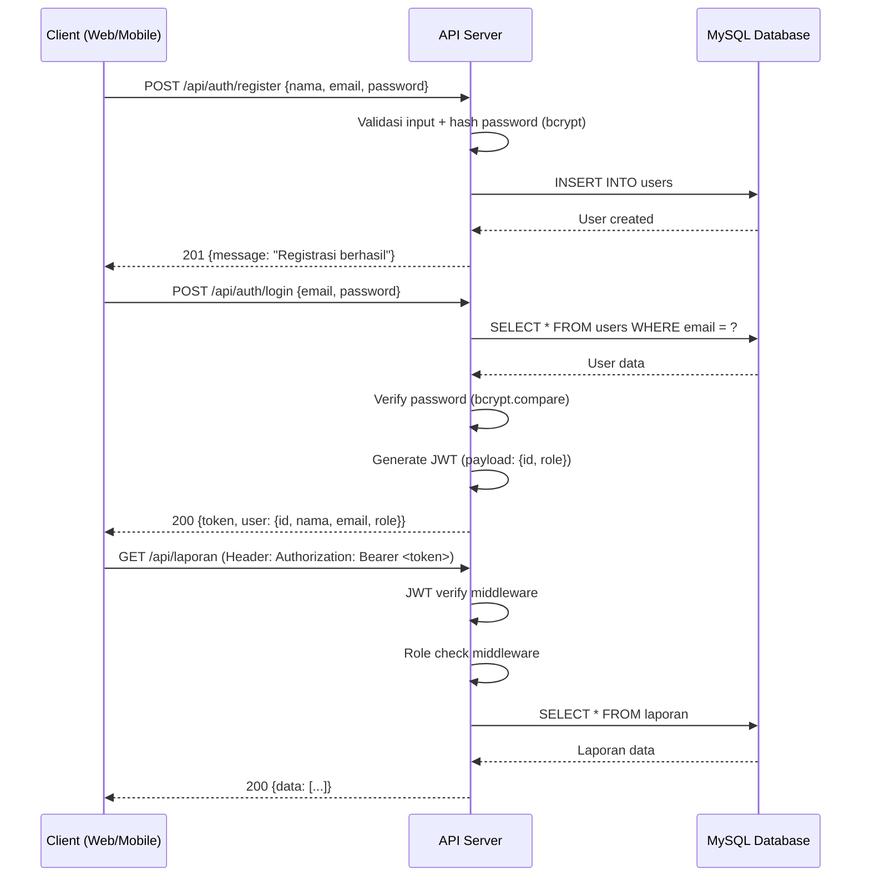
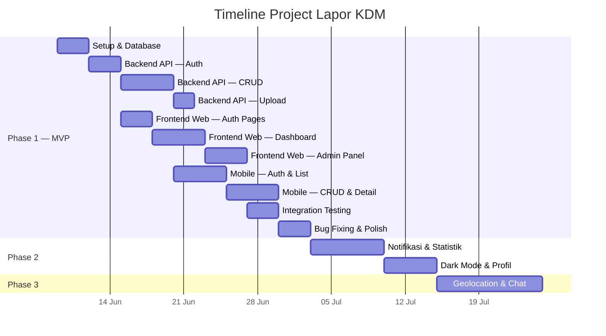

# 📋 Product Requirements Document (PRD)
# Lapor KDM — Sistem Pelaporan Pengaduan Masyarakat Multiplatform

| Field | Value |
|---|---|
| **Nama Produk** | Lapor KDM |
| **Versi Dokumen** | 1.0 |
| **Tanggal** | 6 Juni 2026 |
| **Status** | Draft — Menunggu Review |
| **Platform** | Web (Next.js) · Mobile (React Native) · Backend API (Express.js) |

---

## 1. Executive Summary

**Lapor KDM** adalah sistem pelaporan pengaduan masyarakat berbasis multiplatform yang memungkinkan warga masyarakat menyampaikan keluhan, saran, dan pengaduan secara digital. Sistem ini terdiri dari tiga komponen utama: **Backend API** (Express.js + MySQL), **Frontend Web** (Next.js TypeScript), dan **Frontend Mobile** (React Native).

Platform ini dirancang agar masyarakat dapat melaporkan permasalahan dengan mudah melalui web atau mobile, sementara administrator dapat mengelola, memantau, dan merespon laporan secara efisien melalui dashboard yang terintegrasi.

---

## 2. Goals & Objectives

### 2.1 Business Goals

| # | Goal | Metric Keberhasilan |
|---|---|---|
| G1 | Meningkatkan partisipasi masyarakat dalam pelaporan pengaduan | ≥ 500 laporan masuk per bulan dalam 6 bulan pertama |
| G2 | Mempercepat waktu respon terhadap pengaduan masyarakat | Rata-rata waktu respon < 48 jam |
| G3 | Menyediakan transparansi proses penanganan pengaduan | 100% laporan memiliki status yang ter-update |
| G4 | Mengurangi pengaduan manual (surat/tatap muka) | Pengurangan 60% pengaduan offline dalam 1 tahun |
| G5 | Menyediakan data & analitik pengaduan untuk pengambilan keputusan | Dashboard statistik real-time tersedia untuk admin |

### 2.2 Product Goals

| # | Goal | Deskripsi |
|---|---|---|
| P1 | **Aksesibilitas Multiplatform** | Masyarakat bisa melapor dari mana saja — via web browser atau aplikasi mobile |
| P2 | **Kemudahan Penggunaan** | Proses pelaporan yang intuitif, maksimal 3 langkah dari buka app hingga submit laporan |
| P3 | **Sistem Tracking Transparan** | Pelapor dapat memantau status laporannya secara real-time (Pending → Approved → Rejected) |
| P4 | **Manajemen Terpusat** | Admin/Super Admin memiliki kontrol penuh atas seluruh laporan, user, dan kategori |
| P5 | **Keamanan Data** | Autentikasi JWT, role-based access control, dan enkripsi data sensitif |

### 2.3 User Goals

| Role | Goals |
|---|---|
| **Masyarakat (User)** | Menyampaikan pengaduan dengan mudah, melampirkan bukti foto, dan memantau progress |
| **Admin** | Mengelola laporan masuk, mengubah status, dan memberikan komentar/respon |
| **Super Admin** | Mengelola seluruh sistem termasuk manajemen user, kategori, dan konfigurasi |

---

## 3. Fitur Lengkap

### 3.1 Backend API (Express.js + MySQL)

#### 3.1.1 Autentikasi & Otorisasi

| Fitur | Deskripsi | Prioritas |
|---|---|---|
| Register | Pendaftaran user baru dengan email, nama, password | P0 — Must Have |
| Login | Login dengan email + password, mengembalikan JWT access token | P0 — Must Have |
| JWT Token Verification | Middleware untuk memverifikasi token pada setiap protected route | P0 — Must Have |
| Role-Based Access Control | Middleware pemisahan akses berdasarkan role: `user`, `admin`, `super_admin` | P0 — Must Have |
| Refresh Token | Mekanisme refresh token untuk memperpanjang sesi | P1 — Should Have |
| Logout | Invalidasi token aktif | P1 — Should Have |

#### 3.1.2 Manajemen Laporan (CRUD)

| Fitur | Deskripsi | Prioritas |
|---|---|---|
| Buat Laporan | User membuat laporan dengan judul, deskripsi, kategori, dan lampiran gambar | P0 — Must Have |
| Lihat Daftar Laporan | Menampilkan seluruh laporan dengan pagination, filter, dan sorting | P0 — Must Have |
| Lihat Detail Laporan | Menampilkan detail laporan termasuk komentar dan history status | P0 — Must Have |
| Edit Laporan | User dapat mengedit laporan yang masih berstatus `pending` | P1 — Should Have |
| Hapus Laporan | User dapat menghapus laporannya sendiri; Admin/Super Admin dapat menghapus laporan apapun | P1 — Should Have |
| Update Status Laporan | Admin/Super Admin mengubah status: `pending` → `approved` / `rejected` | P0 — Must Have |
| Upload Gambar | Upload gambar sebagai bukti lampiran laporan (max 5 gambar, max 5MB per gambar) | P0 — Must Have |
| Filter & Search | Filter laporan berdasarkan status, kategori, tanggal; pencarian berdasarkan judul/isi | P1 — Should Have |

#### 3.1.3 Manajemen User (Super Admin Only)

| Fitur | Deskripsi | Prioritas |
|---|---|---|
| Lihat Daftar User | Menampilkan seluruh user terdaftar dengan pagination | P0 — Must Have |
| Tambah User/Admin | Super Admin membuat akun user atau admin baru | P0 — Must Have |
| Edit User | Mengubah data user (nama, email, role) | P0 — Must Have |
| Hapus/Nonaktifkan User | Menonaktifkan atau menghapus akun user | P0 — Must Have |
| Ubah Role User | Mengubah role user (user ↔ admin) | P0 — Must Have |

#### 3.1.4 Manajemen Komentar (CRUD)

| Fitur | Deskripsi | Prioritas |
|---|---|---|
| Tambah Komentar | User/Admin menambah komentar pada laporan | P0 — Must Have |
| Lihat Komentar | Menampilkan daftar komentar pada detail laporan | P0 — Must Have |
| Edit Komentar | Pemilik komentar dapat mengedit komentarnya | P2 — Nice to Have |
| Hapus Komentar | Pemilik komentar atau Admin dapat menghapus komentar | P1 — Should Have |

#### 3.1.5 Manajemen Kategori

| Fitur | Deskripsi | Prioritas |
|---|---|---|
| CRUD Kategori | Admin/Super Admin membuat, membaca, mengubah, dan menghapus kategori laporan | P0 — Must Have |
| Assign Warna Kategori | Setiap kategori dapat di-assign warna dari palet aksen (purple/pink/blue/orange/green) | P1 — Should Have |

#### 3.1.6 API Endpoints Overview

```
AUTH
  POST   /api/auth/register          → Registrasi user baru
  POST   /api/auth/login             → Login & dapatkan JWT
  POST   /api/auth/refresh           → Refresh access token
  POST   /api/auth/logout            → Logout & invalidasi token

LAPORAN
  GET    /api/laporan                → List semua laporan (paginated, filterable)
  GET    /api/laporan/:id            → Detail laporan + komentar
  POST   /api/laporan                → Buat laporan baru (+ upload gambar)
  PUT    /api/laporan/:id            → Edit laporan (owner only, status pending)
  DELETE /api/laporan/:id            → Hapus laporan
  PATCH  /api/laporan/:id/status     → Update status (admin/super_admin)

USER (Super Admin Only)
  GET    /api/users                  → List semua user
  GET    /api/users/:id              → Detail user
  POST   /api/users                  → Buat user/admin baru
  PUT    /api/users/:id              → Edit user
  DELETE /api/users/:id              → Hapus/nonaktifkan user

KOMENTAR
  GET    /api/laporan/:id/komentar   → List komentar pada laporan
  POST   /api/laporan/:id/komentar   → Tambah komentar
  PUT    /api/komentar/:id           → Edit komentar
  DELETE /api/komentar/:id           → Hapus komentar

KATEGORI
  GET    /api/kategori               → List semua kategori
  POST   /api/kategori               → Buat kategori baru
  PUT    /api/kategori/:id           → Edit kategori
  DELETE /api/kategori/:id           → Hapus kategori

UPLOAD
  POST   /api/upload                 → Upload gambar (multipart/form-data)

STATISTIK
  GET    /api/statistik/dashboard    → Data statistik untuk dashboard admin
```

---

### 3.2 Frontend Web (Next.js TypeScript)

| Fitur | Deskripsi | Prioritas |
|---|---|---|
| Halaman Login | Form login dengan email & password | P0 |
| Halaman Register | Form registrasi dengan validasi input | P0 |
| Dashboard Laporan | Tampilan daftar laporan dengan filter, search, dan pagination | P0 |
| Form Tambah Laporan | Form multi-step dengan upload gambar (drag & drop) | P0 |
| Detail Laporan | Halaman detail laporan lengkap dengan komentar dan timeline status | P0 |
| Manajemen Status | Admin panel untuk approve/reject laporan | P0 |
| Dashboard Admin | Panel admin dengan statistik, grafik, dan tabel laporan | P0 |
| Manajemen User | CRUD user untuk Super Admin | P0 |
| Manajemen Kategori | CRUD kategori untuk Admin/Super Admin | P0 |
| Profil User | Halaman profil & edit data diri | P1 |
| Notifikasi | Notifikasi status perubahan laporan | P2 |
| Dark Mode | Toggle dark mode sesuai design system | P2 |

### 3.3 Frontend Mobile (React Native)

| Fitur | Deskripsi | Prioritas |
|---|---|---|
| Splash Screen | Branding screen saat app dibuka | P0 |
| Login Screen | Form login dengan email & password | P0 |
| Register Screen | Form registrasi user baru | P1 |
| List Laporan | Daftar laporan dengan pull-to-refresh dan infinite scroll | P0 |
| Tambah Laporan | Form input laporan dengan camera capture atau gallery picker | P0 |
| Detail Laporan | Detail lengkap laporan + thread komentar | P0 |
| Tambah Komentar | Input komentar pada laporan | P0 |
| Profil User | Halaman profil dan pengaturan | P1 |
| Push Notification | Notifikasi perubahan status laporan | P2 |

---

## 4. User Flow

### 4.1 User Flow — Masyarakat (User)



**Langkah Detail:**

1. **Onboarding** — User membuka web/mobile → diarahkan ke halaman login
2. **Registrasi** — User baru mendaftar dengan nama, email, password → otomatis login
3. **Dashboard** — Setelah login, user melihat daftar laporan (miliknya sendiri + publik)
4. **Buat Laporan** — Klik "Buat Laporan" → isi form (judul, deskripsi, kategori) → upload gambar → submit
5. **Tracking** — User melihat status laporan di dashboard (Pending / Approved / Rejected)
6. **Interaksi** — User membuka detail laporan → membaca komentar admin → membalas
7. **Notifikasi** — User mendapat notifikasi ketika status berubah

---

### 4.2 User Flow — Admin



**Langkah Detail:**

1. **Login** — Admin login dengan kredensial khusus
2. **Dashboard** — Melihat overview: jumlah laporan pending, approved, rejected + grafik tren
3. **Review** — Membuka daftar laporan pending → baca detail → approve/reject + komentar
4. **Kategori** — Mengelola kategori laporan (tambah infrastruktur, lingkungan, dll.)
5. **Monitoring** — Memantau statistik pelaporan harian/mingguan/bulanan

---

### 4.3 User Flow — Super Admin



**Langkah Detail:**

1. **Full Access** — Super Admin memiliki semua akses yang dimiliki Admin
2. **User Management** — Melihat semua user → membuat admin baru → mengubah role → menonaktifkan akun
3. **System Config** — Mengelola konfigurasi sistem secara keseluruhan

---

## 5. UI/UX Design Guidelines

### 5.1 Design Philosophy

Lapor KDM mengadopsi bahasa desain yang **profesional, percaya diri, dan bersih** — bukan startup tech yang playful, melainkan platform layanan publik yang trustworthy dan approachable.

> [!IMPORTANT]
> Seluruh design token di bawah ini mengacu pada [design_lapor_kdm.md](file:///c:/Users/donys/Downloads/PRD%20Lapor%20KDM/design_lapor_kdm.md) sebagai single source of truth.

### 5.2 Color System

#### Primary & Surface

| Token | Hex | Penggunaan |
|---|---|---|
| `primary` | `#080808` | CTA utama, heading, wordmark — near-black yang branded |
| `on-primary` | `#ffffff` | Teks di atas surface primary |
| `canvas` | `#ffffff` | Background halaman default |
| `hairline` | `#d8d8d8` | Border card, input, divider — 1px solid |

#### Five-Stop Chromatic Accent System

Setiap aksen di-mapping ke area fungsional platform:

| Aksen | Hex | Area Fungsional | Contoh Penggunaan |
|---|---|---|---|
| 🟣 Purple | `#7a3dff` | Kategori Infrastruktur | Category card, badge |
| 🩷 Pink | `#ed52cb` | Kategori Sosial | Category card, badge |
| 🔵 Blue | `#3b89ff` | Kategori Lingkungan | Category card, badge |
| 🟠 Orange | `#ff6b00` | Kategori Pelayanan Publik | Category card, badge |
| 🟢 Green | `#00d722` | Status Selesai / Success | Status badge, category card |

> [!WARNING]
> Aksen HANYA digunakan sebagai **surface fill pada category card dan badge**, BUKAN sebagai warna tombol. Tombol utama selalu `#080808`.

#### Semantic Colors

| Token | Hex | Fungsi |
|---|---|---|
| `accent-blue-info` | `#146ef5` | Badge info, notifikasi |
| `accent-green` | `#00d722` | Status sukses (Approved) |
| `accent-yellow` | `#ffae13` | Status warning (Pending) |
| `accent-red` | `#ee1d36` | Status error (Rejected), validasi |

#### Text Hierarchy

| Token | Hex | Penggunaan |
|---|---|---|
| `ink` | `#080808` | Heading, teks utama |
| `ink-strong` | `#222222` | Emphasis near-black |
| `body` | `#363636` | Paragraf body default |
| `body-mid` | `#5a5a5a` | Teks sekunder, footer, caption |
| `mute` | `#898989` | Teks prioritas rendah |
| `mute-soft` | `#ababab` | Placeholder, fine print |

### 5.3 Typography

#### Font Family

- **Primary**: `WF Visual Sans Variable` → fallback `Inter`, `system-ui`, `-apple-system`, `sans-serif`
- **Monospace**: `WFVisualSans-Mono` → fallback `Inconsolata`, `ui-monospace`
- **Weight ceiling**: Maksimal **600** (semibold). Brand tidak pernah menggunakan 700+.

#### Type Scale

| Role | Size | Weight | Penggunaan di Platform |
|---|---|---|---|
| Display XXL | 80px / 600 | Semibold | Hero headline landing page |
| Display XL | 56px / 600 | Semibold | Sub-hero section |
| Display LG | 44.8px / 600 | Semibold | Section headline |
| Display MD | 32px / 500 | Medium | Card headline, page title |
| Display SM | 24px / 500 | Medium | Sub-section title |
| Display XS | 20px / 500 | Medium | Widget title, modal title |
| Eyebrow | 15px / 500 | Medium | Section label (UPPERCASE, tracking +1.5px) |
| Body LG | 28.8px / 400 | Regular | Lead paragraph |
| Body MD | 16px / 400 | Regular | Default body text |
| Body SM | 14px / 400 | Regular | Secondary text, caption |
| Caption | 12.8px / 550 | Book | Badge label (brand signature weight) |
| Button | 16px / 500 | Medium | Label tombol |

### 5.4 Shape & Elevation

#### Border Radius

| Token | Value | Penggunaan |
|---|---|---|
| `rounded.sm` | 4px | Tombol, badge, input — brand yang engineered |
| `rounded.md` | 8px | Card laporan, modal, form card |
| `rounded.full` | 9999px | Icon container circular saja |

> [!CAUTION]
> **JANGAN** gunakan pill shape untuk CTA. Brand menggunakan radius 4px yang ketat dan geometris.

#### Elevation Levels

| Level | Penggunaan |
|---|---|
| **Level 0** — Flat | Band section default, tanpa shadow |
| **Level 1** — Hairline | Card default dengan 1px border `#d8d8d8` |
| **Level 2** — Layered Drop | Card featured, laporan ter-highlight |
| **Level 3** — Strong Drop | Pricing card, modal emphasis |
| **Level 4** — Heavy Modal | Dialog/modal overlay |

### 5.5 Component Guidelines

#### Buttons

| Variant | Style | Penggunaan |
|---|---|---|
| **Primary** | BG `#080808`, text white, radius 4px | Submit laporan, Login, Approve |
| **Secondary** | BG white, border `#d8d8d8`, text ink | Cancel, Filter, secondary action |
| **Text Arrow** | Text only + arrow icon | "Lihat Selengkapnya", navigasi kontekstual |
| **Icon Circular** | Circle, icon only | Carousel control, close button |

#### Cards

| Variant | Penggunaan |
|---|---|
| **Card Feature** | Menampilkan laporan individual di dashboard |
| **Card Feature Dark** | Highlight laporan penting / statistik |
| **Category Card** | Menampilkan kategori laporan dengan warna aksen penuh |
| **Card Pricing** | (Tidak digunakan di v1) |

#### Form Inputs

- Background putih, border hairline 1px, radius 4px
- Placeholder text `#ababab`
- Focus state: border `#080808`
- Error state: border `#ee1d36` + pesan error merah

### 5.6 Responsive Design

| Breakpoint | Width | Layout |
|---|---|---|
| Mobile | < 479px | Single column, hamburger nav, stacked cards |
| Mobile Large | 479–767px | Single column, slight padding increase |
| Tablet | 768–991px | 2-column grid, sidebar collapse |
| Desktop | ≥ 992px | Full multi-column layout, sidebar visible |

### 5.7 Key Screens Wireframe Description

#### Landing / Login Page
- Hero band dengan headline Display XXL: "Lapor KDM"
- Sub-headline Body LG: tagline platform
- Form login centered di card feature dengan shadow Level 2
- CTA Login (button-primary) + link Register

#### Dashboard Laporan
- Top nav bar dengan logo, nav links, user avatar
- Eyebrow section header "DAFTAR LAPORAN" (15px/500/+1.5px tracking)
- Filter bar: dropdown status, dropdown kategori, search input
- Grid card laporan (2–3 columns desktop, 1 column mobile)
- Setiap card menampilkan: judul, kategori badge (warna aksen), status badge, tanggal, thumbnail

#### Form Tambah Laporan
- Modal atau halaman full dengan card form
- Input: Judul (text-input), Kategori (dropdown), Deskripsi (textarea)
- Upload area: drag-and-drop dengan preview thumbnail
- CTA: "Kirim Laporan" (button-primary)

#### Detail Laporan
- Header: judul, status badge, tanggal, pelapor
- Body: deskripsi lengkap + gallery gambar
- Timeline status changes
- Section komentar dengan input field di bawah

#### Dashboard Admin
- Sidebar navigasi dengan icon
- Panel statistik: total laporan, pending, approved, rejected (card numerik)
- Grafik tren pelaporan (bar/line chart)
- Tabel laporan terbaru dengan aksi cepat (approve/reject)

---

## 6. Database Overview

### 6.1 Entity Relationship Diagram (ERD)



### 6.2 Tabel Detail

#### `users`

| Kolom | Tipe | Constraint | Keterangan |
|---|---|---|---|
| `id` | INT | PK, AUTO_INCREMENT | Primary key |
| `nama` | VARCHAR(100) | NOT NULL | Nama lengkap user |
| `email` | VARCHAR(255) | NOT NULL, UNIQUE | Email login |
| `password` | VARCHAR(255) | NOT NULL | Password hash (bcrypt) |
| `role` | ENUM('user','admin','super_admin') | NOT NULL, DEFAULT 'user' | Role akses |
| `avatar_url` | VARCHAR(500) | NULLABLE | URL foto profil |
| `is_active` | BOOLEAN | NOT NULL, DEFAULT TRUE | Status aktif/nonaktif |
| `created_at` | DATETIME | NOT NULL, DEFAULT CURRENT_TIMESTAMP | Waktu registrasi |
| `updated_at` | DATETIME | NOT NULL, ON UPDATE CURRENT_TIMESTAMP | Waktu update terakhir |

#### `kategori`

| Kolom | Tipe | Constraint | Keterangan |
|---|---|---|---|
| `id` | INT | PK, AUTO_INCREMENT | Primary key |
| `nama` | VARCHAR(100) | NOT NULL, UNIQUE | Nama kategori |
| `deskripsi` | TEXT | NULLABLE | Deskripsi kategori |
| `warna` | VARCHAR(7) | NULLABLE | Hex color (e.g. `#7a3dff`) |
| `created_at` | DATETIME | NOT NULL, DEFAULT CURRENT_TIMESTAMP | — |
| `updated_at` | DATETIME | NOT NULL, ON UPDATE CURRENT_TIMESTAMP | — |

#### `laporan`

| Kolom | Tipe | Constraint | Keterangan |
|---|---|---|---|
| `id` | INT | PK, AUTO_INCREMENT | Primary key |
| `user_id` | INT | FK → users.id, NOT NULL | Pelapor |
| `kategori_id` | INT | FK → kategori.id, NOT NULL | Kategori laporan |
| `judul` | VARCHAR(255) | NOT NULL | Judul laporan |
| `deskripsi` | TEXT | NOT NULL | Isi lengkap laporan |
| `status` | ENUM('pending','approved','rejected') | NOT NULL, DEFAULT 'pending' | Status laporan |
| `created_at` | DATETIME | NOT NULL, DEFAULT CURRENT_TIMESTAMP | Waktu laporan dibuat |
| `updated_at` | DATETIME | NOT NULL, ON UPDATE CURRENT_TIMESTAMP | Waktu update terakhir |

#### `komentar`

| Kolom | Tipe | Constraint | Keterangan |
|---|---|---|---|
| `id` | INT | PK, AUTO_INCREMENT | Primary key |
| `laporan_id` | INT | FK → laporan.id, NOT NULL | Laporan terkait |
| `user_id` | INT | FK → users.id, NOT NULL | Pembuat komentar |
| `isi` | TEXT | NOT NULL | Isi komentar |
| `created_at` | DATETIME | NOT NULL, DEFAULT CURRENT_TIMESTAMP | Waktu komentar |
| `updated_at` | DATETIME | NOT NULL, ON UPDATE CURRENT_TIMESTAMP | — |

#### `gambar`

| Kolom | Tipe | Constraint | Keterangan |
|---|---|---|---|
| `id` | INT | PK, AUTO_INCREMENT | Primary key |
| `laporan_id` | INT | FK → laporan.id, NOT NULL | Laporan terkait |
| `url` | VARCHAR(500) | NOT NULL | Path/URL file gambar |
| `filename` | VARCHAR(255) | NOT NULL | Nama file asli |
| `size_bytes` | INT | NOT NULL | Ukuran file dalam bytes |
| `created_at` | DATETIME | NOT NULL, DEFAULT CURRENT_TIMESTAMP | Waktu upload |

### 6.3 Relasi Antar Tabel

| Relasi | Tipe | Deskripsi |
|---|---|---|
| `users` → `laporan` | One-to-Many | Satu user dapat membuat banyak laporan |
| `users` → `komentar` | One-to-Many | Satu user dapat menulis banyak komentar |
| `kategori` → `laporan` | One-to-Many | Satu kategori memiliki banyak laporan |
| `laporan` → `komentar` | One-to-Many | Satu laporan memiliki banyak komentar |
| `laporan` → `gambar` | One-to-Many | Satu laporan memiliki banyak gambar lampiran |

### 6.4 Indexing Strategy

| Tabel | Index | Kolom | Tujuan |
|---|---|---|---|
| `users` | UNIQUE | `email` | Lookup login cepat |
| `laporan` | INDEX | `user_id` | Query laporan per user |
| `laporan` | INDEX | `kategori_id` | Filter per kategori |
| `laporan` | INDEX | `status` | Filter per status |
| `laporan` | INDEX | `created_at` | Sorting kronologis |
| `komentar` | INDEX | `laporan_id` | Query komentar per laporan |
| `gambar` | INDEX | `laporan_id` | Query gambar per laporan |

---

## 7. Technical Requirements

### 7.1 Technology Stack

| Layer | Teknologi | Versi Minimum |
|---|---|---|
| **Backend Runtime** | Node.js | ≥ 18 LTS |
| **Backend Framework** | Express.js | ≥ 4.18 |
| **Database** | MySQL | ≥ 8.0 |
| **ORM/Query Builder** | Sequelize atau Knex.js | Latest stable |
| **Frontend Web** | Next.js (TypeScript) | ≥ 14 |
| **Frontend Mobile** | React Native (Expo) | ≥ 0.73 / Expo SDK 50+ |
| **Auth** | JSON Web Token (JWT) | jsonwebtoken library |
| **File Upload** | Multer | ≥ 1.4 |
| **Password Hashing** | bcryptjs | ≥ 2.4 |
| **Validation** | Joi atau Zod | Latest stable |
| **HTTP Client (Mobile)** | Axios | ≥ 1.6 |

### 7.2 Architecture Overview



### 7.3 Authentication Flow



### 7.4 Non-Functional Requirements

| Requirement | Spesifikasi |
|---|---|
| **Performance** | API response time < 500ms untuk 95th percentile |
| **Scalability** | Mendukung hingga 10.000 concurrent users |
| **Security** | JWT expiry 24h, password hash bcrypt (salt rounds: 10), SQL injection prevention via parameterized queries |
| **File Upload** | Max 5 gambar per laporan, max 5MB per file, format: JPG/PNG/WebP |
| **API Rate Limiting** | 100 requests/minute per IP |
| **CORS** | Dikonfigurasi untuk domain web dan mobile |
| **Error Handling** | Consistent error response format: `{success: false, message: string, errors?: array}` |
| **Logging** | Request/response logging (Morgan), error logging (Winston) |
| **Availability** | Target uptime 99.5% |

### 7.5 API Response Format

#### Success Response
```json
{
  "success": true,
  "message": "Data berhasil diambil",
  "data": { ... },
  "pagination": {
    "page": 1,
    "limit": 10,
    "total": 150,
    "totalPages": 15
  }
}
```

#### Error Response
```json
{
  "success": false,
  "message": "Validasi gagal",
  "errors": [
    { "field": "email", "message": "Email sudah terdaftar" }
  ]
}
```

### 7.6 Environment & Deployment

| Komponen | Development | Production |
|---|---|---|
| Backend | `localhost:5000` | Cloud server (VPS / Railway / Render) |
| Database | MySQL local | MySQL cloud (PlanetScale / managed MySQL) |
| Web Frontend | `localhost:3000` | Vercel / Netlify |
| Mobile | Expo Go | APK build / Play Store |
| File Storage | Local `/uploads` | Cloud storage (Cloudinary / S3) |

### 7.7 Folder Structure

#### Backend (Express.js)
```
lapor-kdm-api/
├── src/
│   ├── config/
│   │   ├── database.js          # Konfigurasi MySQL/Sequelize
│   │   └── multer.js            # Konfigurasi upload file
│   ├── controllers/
│   │   ├── authController.js
│   │   ├── laporanController.js
│   │   ├── userController.js
│   │   ├── komentarController.js
│   │   └── kategoriController.js
│   ├── middlewares/
│   │   ├── auth.js              # JWT verification
│   │   ├── role.js              # Role-based access
│   │   ├── validate.js          # Input validation
│   │   └── errorHandler.js      # Global error handler
│   ├── models/
│   │   ├── User.js
│   │   ├── Laporan.js
│   │   ├── Komentar.js
│   │   ├── Kategori.js
│   │   └── Gambar.js
│   ├── routes/
│   │   ├── authRoutes.js
│   │   ├── laporanRoutes.js
│   │   ├── userRoutes.js
│   │   ├── komentarRoutes.js
│   │   └── kategoriRoutes.js
│   ├── utils/
│   │   └── helpers.js
│   └── app.js                   # Express app setup
├── uploads/                     # Local file uploads
├── .env
├── package.json
└── server.js                    # Entry point
```

#### Frontend Web (Next.js TypeScript)
```
lapor-kdm-web/
├── src/
│   ├── app/
│   │   ├── (auth)/
│   │   │   ├── login/page.tsx
│   │   │   └── register/page.tsx
│   │   ├── (dashboard)/
│   │   │   ├── dashboard/page.tsx
│   │   │   ├── laporan/
│   │   │   │   ├── page.tsx           # List laporan
│   │   │   │   ├── [id]/page.tsx      # Detail laporan
│   │   │   │   └── tambah/page.tsx    # Form tambah
│   │   │   ├── admin/
│   │   │   │   ├── page.tsx           # Admin dashboard
│   │   │   │   ├── users/page.tsx     # Manajemen user
│   │   │   │   └── kategori/page.tsx  # Manajemen kategori
│   │   │   └── profil/page.tsx
│   │   ├── layout.tsx
│   │   └── page.tsx                   # Landing/home
│   ├── components/
│   │   ├── ui/                        # Design system components
│   │   ├── forms/
│   │   ├── layout/
│   │   └── laporan/
│   ├── lib/
│   │   ├── api.ts                     # API client (Axios)
│   │   ├── auth.ts                    # Auth utilities
│   │   └── types.ts                   # TypeScript interfaces
│   ├── hooks/
│   ├── context/
│   └── styles/
│       └── globals.css
├── public/
├── next.config.js
├── tsconfig.json
└── package.json
```

#### Frontend Mobile (React Native)
```
lapor-kdm-mobile/
├── src/
│   ├── screens/
│   │   ├── LoginScreen.tsx
│   │   ├── RegisterScreen.tsx
│   │   ├── HomeScreen.tsx             # List laporan
│   │   ├── DetailLaporanScreen.tsx
│   │   ├── TambahLaporanScreen.tsx
│   │   └── ProfilScreen.tsx
│   ├── components/
│   │   ├── LaporanCard.tsx
│   │   ├── KomentarItem.tsx
│   │   ├── StatusBadge.tsx
│   │   └── ImagePicker.tsx
│   ├── navigation/
│   │   └── AppNavigator.tsx
│   ├── services/
│   │   └── api.ts
│   ├── context/
│   │   └── AuthContext.tsx
│   ├── hooks/
│   ├── utils/
│   └── types/
├── assets/
├── app.json
├── App.tsx
└── package.json
```

---

## 8. Scope Project

### 8.1 In Scope (Phase 1 — MVP)

| Area | Deliverables |
|---|---|
| **Backend** | REST API lengkap dengan auth JWT, CRUD laporan/user/komentar/kategori, upload gambar, role middleware |
| **Web Frontend** | Login, Register, Dashboard, CRUD Laporan, Detail + Komentar, Admin Panel, Manajemen User |
| **Mobile Frontend** | Login, List Laporan, Tambah Laporan, Detail + Komentar |
| **Database** | MySQL dengan 5 tabel utama (users, kategori, laporan, komentar, gambar) |
| **Design System** | Implementasi penuh design token dari design_lapor_kdm.md |

### 8.2 Phase 2 — Enhancement

| Area | Deliverables |
|---|---|
| Register di Mobile | Form registrasi pada app mobile |
| Push Notification | Notifikasi real-time perubahan status laporan (Firebase/OneSignal) |
| Dashboard Statistik | Grafik & analytics di admin panel (Chart.js / Recharts) |
| Dark Mode | Implementasi dark mode di web dan mobile |
| Profil User | Edit profil, upload avatar, ganti password |
| Export Data | Export laporan ke PDF/Excel |

### 8.3 Phase 3 — Advanced

| Area | Deliverables |
|---|---|
| Geolocation | Peta lokasi pengaduan (Google Maps / Mapbox) |
| Real-time Chat | Chat antara user dan admin (WebSocket / Socket.io) |
| OCR | Scan dokumen sebagai lampiran |
| Multi-language | Dukungan multi-bahasa (ID/EN) |
| Progressive Web App | PWA support untuk web |
| AI Categorization | Auto-kategorisasi laporan menggunakan NLP |

### 8.4 Out of Scope

| Item | Alasan |
|---|---|
| Payment/billing system | Bukan platform berbayar |
| Social media integration | Tidak diperlukan di MVP |
| Video upload | Fokus pada gambar di Phase 1 |
| iOS App Store deployment | Phase 1 fokus APK/Expo Go |
| Multi-tenant (multi-daerah) | Phase 1 single instance |

### 8.5 Estimasi Timeline



| Phase | Durasi Estimasi | Target Selesai |
|---|---|---|
| **Phase 1 — MVP** | 6–8 minggu | Akhir Juli 2026 |
| **Phase 2 — Enhancement** | 3–4 minggu | Akhir Agustus 2026 |
| **Phase 3 — Advanced** | 4–6 minggu | Oktober 2026 |

### 8.6 Risiko & Mitigasi

| Risiko | Dampak | Mitigasi |
|---|---|---|
| Keterbatasan resource developer | Timeline molor | Prioritasi fitur MVP, gunakan code generator |
| Keamanan data pengaduan | Kebocoran data sensitif | JWT + bcrypt + HTTPS + input sanitization |
| Skalabilitas database | Performance drop saat data besar | Indexing strategy, pagination, query optimization |
| Kompatibilitas mobile | UI/UX tidak konsisten di berbagai device | Testing di multiple devices, responsive design |
| Adopsi user rendah | Platform tidak terpakai | UX yang intuitif, sosialisasi, feedback loop |
| Downtime server | Layanan tidak tersedia | Monitoring, auto-restart, backup strategy |

---

## 9. Success Metrics

| Metric | Target (6 bulan) | Cara Ukur |
|---|---|---|
| **Total User Terdaftar** | ≥ 1.000 | Count di database |
| **Laporan Masuk/Bulan** | ≥ 500 | Dashboard statistik |
| **Rata-rata Response Time Admin** | < 48 jam | Selisih `created_at` laporan vs first komentar admin |
| **Completion Rate Laporan** | ≥ 80% | % laporan yang di-approve/reject vs total |
| **Uptime** | ≥ 99.5% | Server monitoring |
| **User Satisfaction** | ≥ 4.0/5.0 | Survey / rating in-app |
| **Mobile App Rating** | ≥ 4.0/5.0 | Play Store rating |

---

> [!NOTE]
> Dokumen PRD ini adalah **living document** yang akan di-update seiring perkembangan project. Setiap perubahan signifikan harus melalui review dan persetujuan stakeholder.

---

*Dokumen ini dibuat berdasarkan analisis dari [Sistem Pelaporan Pengaduan Masyarakat Multiplatform.pdf](file:///c:/Users/donys/Downloads/PRD%20Lapor%20KDM/Sistem%20Pelaporan%20Pengaduan%20Masyarakat%20Multiplatform.pdf) dan [design_lapor_kdm.md](file:///c:/Users/donys/Downloads/PRD%20Lapor%20KDM/design_lapor_kdm.md).*
